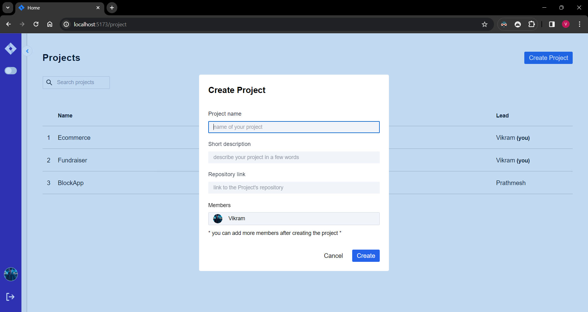
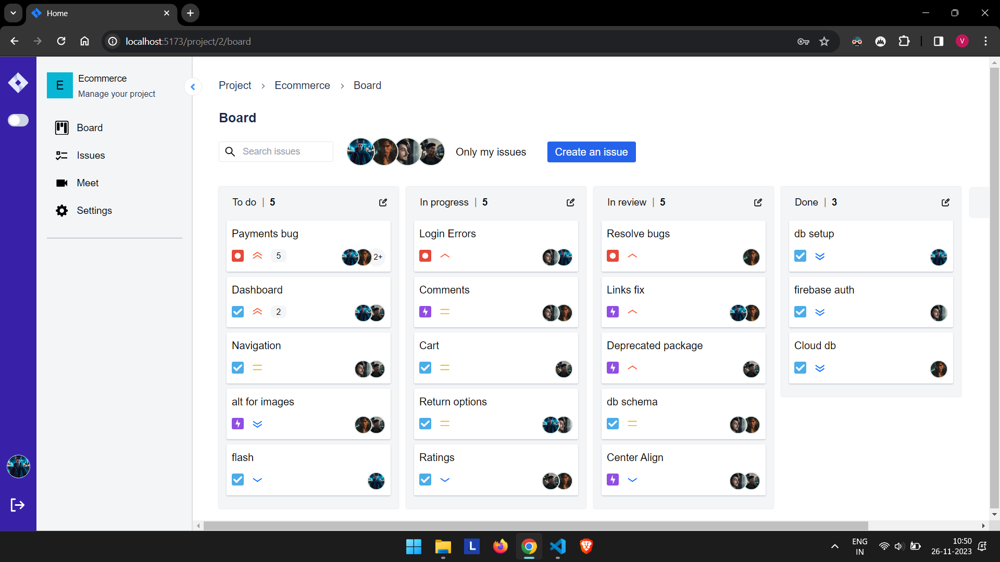
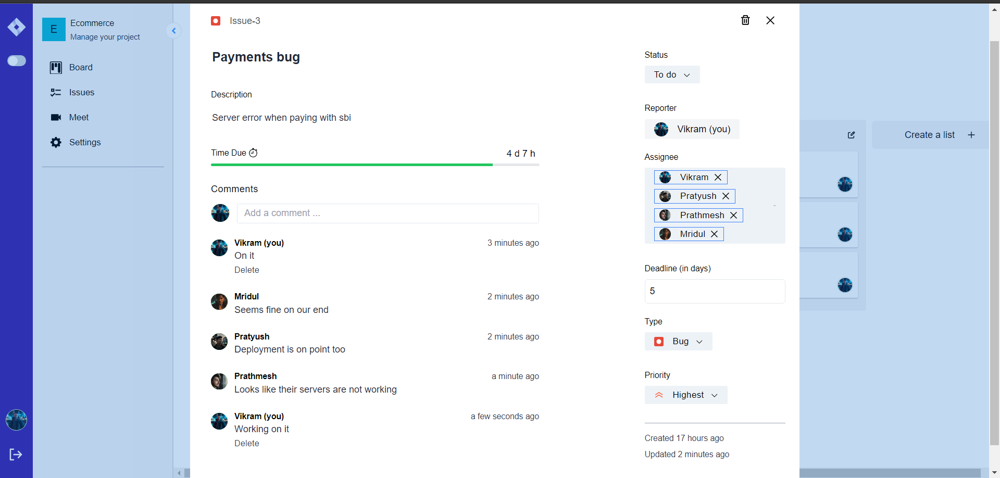
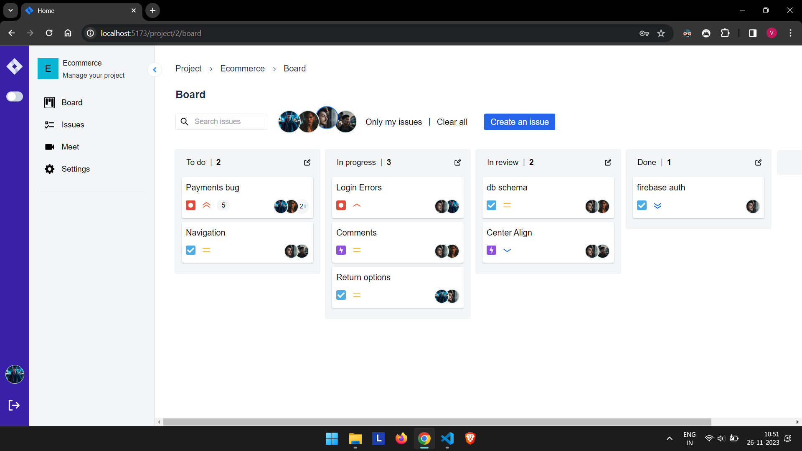
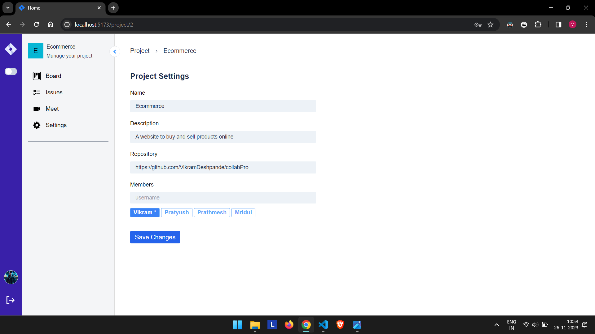
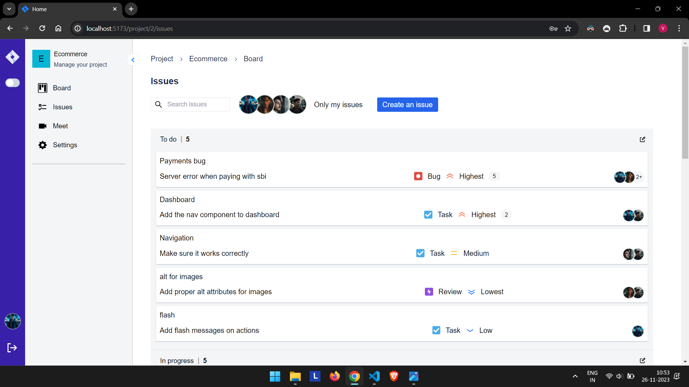
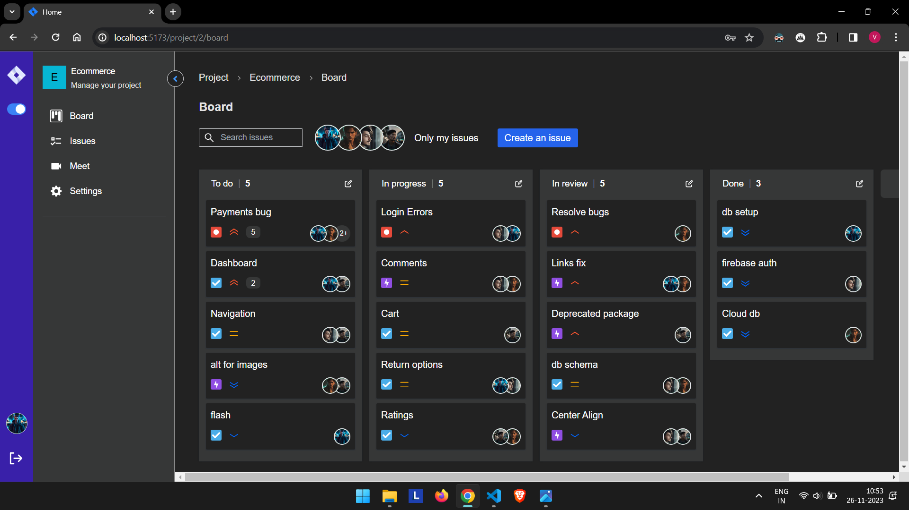

`# Project Collaboration Platform

## Purpose of the project:

The purpose of our "Project Collaboration Platform" is to provide a robust and user-friendly solution for project management and team collaboration. This project aims to solve the problem of delegating tasks to team members, tracking progress and making sure everyone is on the same page.

## Features

* **Projects and Issues Management**

* **Adding members to the project** 

* **Removing members from the project** 

* **Drag and drop interface**

* **Assign tasks to members**

* **Filter tasks by team members**

* **Comment Section for every task**

* **Create Meeting**

* **Get Summary of meeting**

* **User Profile Management**

## Screenshots

||  | ||
||  | ||
||  | ||  | ||

## Tech Stack

The project uses the following tech stack:

* Frontend: React, JavaScript, TypeScript
* Backend: MySQL, Express.js, Node.js

